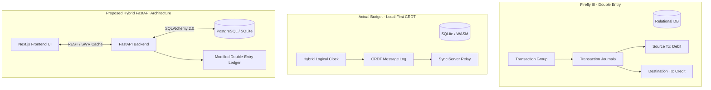
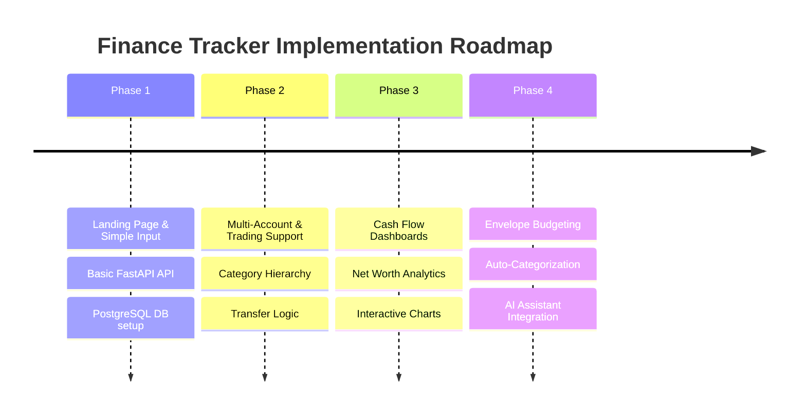

# Personal Finance Tracker System Architecture & Knowledge Base
> **Tags**: #finance-tracker #architecture #fastapi #nextjs #local-first #obsidian-vault #docker #database-schema  
> **Target Environment**: Headless Ubuntu Home Server (Dockerized)  
> **Tech Stack**: Next.js (React) + FastAPI (Python 3.12) + PostgreSQL / SQLite  

---

## 1. Architecture Analysis: Open-Source Finance Trackers

To design an efficient, resilient, and lightweight personal finance system for a local home server, we analyze the architectural patterns of leading open-source financial managers: [[Firefly III]], [[Actual Budget]], and [[MoneyMatter]].



### 1.1 Firefly III: Strict Double-Entry Bookkeeping Schema
[[Firefly III]] is built around formal accounting concepts:

* **Structure**: Uses a deeply normalized relational schema (~32 tables). Transactions are abstracted into three layers:
  1. `transaction_groups`: Wraps related multi-step operations or split receipts.
  2. `transaction_journals`: Holds event metadata (category, budget, date, tags).
  3. `transactions`: Stores individual debit/credit rows. Every journal links at least two transaction entries (Source Account balance decreases, Destination Account balance increases).
* **Strengths**: 
  * Absolute mathematical auditability: $\sum \text{Debits} - \sum \text{Credits} = 0$.
  * Prevents phantom money creation; accurate tracking of liability, asset, and expense accounts.
* **Weaknesses**:
  * High query complexity: Simple balance queries require joining `transaction_journals`, `transactions`, and `accounts`.
  * Overhead for single-user cash flow: Excessive boilerplates for trivial daily expense logs.

### 1.2 Actual Budget: Local-First CRDT & Envelope System
[[Actual Budget]] prioritizes speed and offline resilience:

* **Structure**: Client-side primary state with local **SQLite** (or SQLite via WebAssembly in browser). Syncs across devices using **Conflict-free Replicated Data Types (CRDTs)** and **Hybrid Unique Logical Clocks (HULC)**.
* **Sync Protocol**: Edits are stored as atomic change messages (`dataset, row, column, value, timestamp`). The server functions as an encrypted "dumb relay".
* **Strengths**:
  * Zero-latency UI response (all reads/writes execute against local WASM SQLite).
  * 100% functional offline capability.
  * Native Envelope Budgeting ("Zero-Based Budgeting").
* **Weaknesses**:
  * Complex client-side conflict resolution logic.
  * Server cannot easily run server-side analytics, background aggregations, or external API integrations without decrypting client state.

### 1.3 MoneyMatter / Modern Trackers: Cash-Flow & Trading Account Focus
Modern cash flow trackers emphasize stream-based net worth tracking, multi-asset handling (stocks, crypto, high-yield cash accounts), and automated categorizations.

* **Structure**: Simplified transaction records with explicit support for investment cash flows (deposits/withdrawals to brokerage accounts, realized gains/losses).

---

### 1.4 Synthesis: Proposed Architecture for FastAPI & Next.js

For a self-hosted home server deployment, a **Modified Double-Entry Cash Flow Engine** offers the optimal balance between accounting integrity and developer velocity:

> [!TIP]
> **Architectural Recommendation**: Use a **Server-Authoritative Modified Double-Entry Model**.
> Instead of 32 normalized tables (Firefly III) or complex CRDT sync (Actual Budget), we utilize a dual-account reference model (`from_account_id` and `to_account_id`) within a single transaction record. This preserves double-entry principles (money moves from source to destination) in a single high-performance SQL table.

#### Key Architectural Decisions:
1. **Backend**: FastAPI with `SQLAlchemy 2.0` (async engine) & `Pydantic v2` schemas. FastAPI provides sub-millisecond execution times, automatic OpenAPI documentation, and effortless data validation.
2. **Frontend**: Next.js (App Router, React 19) with `SWR` / `TanStack Query` for aggressive client-side caching, giving a local-first feel while staying backed by the home server database.
3. **Database**: PostgreSQL (for production container deployments) or SQLite (for zero-config single-file storage).

---

## 2. Database Schema Design

The following PostgreSQL schema supports:
- Standard checking/savings/credit cash flow.
- Trading account cash movements (deposits to broker, withdrawals, dividends).
- Hierarchical category trees (e.g., `Housing` -> `Rent`).
- Split transactions and transfer tracking.

```sql
-- Enable UUID extension
CREATE EXTENSION IF NOT EXISTS "uuid-ossp";

-- ============================================================================
-- ACCOUNTS TABLE
-- ============================================================================
-- Handles liquid accounts, credit cards, external merchants, and trading cash accounts.
CREATE TYPE account_type AS ENUM (
    'checking', 
    'savings', 
    'credit_card', 
    'trading_cash', 
    'investment',
    'external_merchant', -- Source/Destination for external income/expense
    'system_initial'    -- Used for initial balance seeding
);

CREATE TABLE accounts (
    id UUID PRIMARY KEY DEFAULT uuid_generate_v4(),
    name VARCHAR(100) NOT NULL,
    type account_type NOT NULL,
    currency VARCHAR(3) NOT NULL DEFAULT 'USD',
    current_balance DECIMAL(14, 2) NOT NULL DEFAULT 0.00,
    institution_name VARCHAR(100),
    account_number_suffix VARCHAR(10),
    is_active BOOLEAN NOT NULL DEFAULT TRUE,
    created_at TIMESTAMP WITH TIME ZONE DEFAULT CURRENT_TIMESTAMP,
    updated_at TIMESTAMP WITH TIME ZONE DEFAULT CURRENT_TIMESTAMP
);

-- ============================================================================
-- CATEGORIES TABLE
-- ============================================================================
-- Hierarchical category taxonomy supporting parent-child relationships.
CREATE TYPE category_type AS ENUM ('income', 'expense', 'transfer');

CREATE TABLE categories (
    id UUID PRIMARY KEY DEFAULT uuid_generate_v4(),
    parent_id UUID REFERENCES categories(id) ON DELETE SET NULL,
    name VARCHAR(80) NOT NULL,
    type category_type NOT NULL,
    icon VARCHAR(50),  -- Lucide icon identifier
    color VARCHAR(20), -- Hex color code for UI
    is_system BOOLEAN DEFAULT FALSE,
    created_at TIMESTAMP WITH TIME ZONE DEFAULT CURRENT_TIMESTAMP
);

-- ============================================================================
-- TRANSACTIONS TABLE (MODIFIED DOUBLE-ENTRY)
-- ============================================================================
-- Single ledger row enforcing Movement of Value (from_account -> to_account).
CREATE TYPE transaction_type AS ENUM (
    'income', 
    'expense', 
    'transfer', 
    'trading_deposit', 
    'trading_withdrawal',
    'dividend'
);

CREATE TYPE transaction_status AS ENUM ('pending', 'cleared', 'reconciled');

CREATE TABLE transactions (
    id UUID PRIMARY KEY DEFAULT uuid_generate_v4(),
    transaction_date DATE NOT NULL,
    amount DECIMAL(14, 2) NOT NULL CHECK (amount > 0),
    type transaction_type NOT NULL,
    status transaction_status NOT NULL DEFAULT 'cleared',
    
    -- Double-entry movement links
    from_account_id UUID NOT NULL REFERENCES accounts(id) ON DELETE RESTRICT,
    to_account_id UUID NOT NULL REFERENCES accounts(id) ON DELETE RESTRICT,
    category_id UUID REFERENCES categories(id) ON DELETE SET NULL,
    
    description VARCHAR(255) NOT NULL,
    notes TEXT,
    tags TEXT[], -- Array of search tags e.g. {'tax-deductible', 'vacation'}
    
    created_at TIMESTAMP WITH TIME ZONE DEFAULT CURRENT_TIMESTAMP,
    updated_at TIMESTAMP WITH TIME ZONE DEFAULT CURRENT_TIMESTAMP,

    CONSTRAINT chk_different_accounts CHECK (from_account_id <> to_account_id)
);

-- ============================================================================
-- TRADING POSITIONS (EXTENSION TABLE FOR TRADING ACCOUNTS)
-- ============================================================================
-- Tracks equity/ETF holdings linked to trading cash accounts.
CREATE TABLE trading_positions (
    id UUID PRIMARY KEY DEFAULT uuid_generate_v4(),
    account_id UUID NOT NULL REFERENCES accounts(id) ON DELETE CASCADE,
    ticker VARCHAR(20) NOT NULL,
    asset_name VARCHAR(100),
    quantity DECIMAL(14, 4) NOT NULL DEFAULT 0,
    average_buy_price DECIMAL(14, 2) NOT NULL DEFAULT 0,
    current_market_price DECIMAL(14, 2),
    updated_at TIMESTAMP WITH TIME ZONE DEFAULT CURRENT_TIMESTAMP,
    UNIQUE(account_id, ticker)
);

-- ============================================================================
-- INDEXES & VIEWS FOR HIGH-PERFORMANCE DASHBOARDS
-- ============================================================================
CREATE INDEX idx_transactions_date ON transactions(transaction_date DESC);
CREATE INDEX idx_transactions_from_acc ON transactions(from_account_id);
CREATE INDEX idx_transactions_to_acc ON transactions(to_account_id);
CREATE INDEX idx_transactions_category ON transactions(category_id);

-- View: Calculated Real-Time Account Balances from Ledger
CREATE VIEW v_account_calculated_balances AS
SELECT 
    a.id AS account_id,
    a.name AS account_name,
    a.type AS account_type,
    COALESCE(SUM(
        CASE 
            WHEN t.to_account_id = a.id THEN t.amount
            WHEN t.from_account_id = a.id THEN -t.amount
            ELSE 0
        END
    ), 0.00) AS calculated_balance
FROM accounts a
LEFT JOIN transactions t ON a.id = t.from_account_id OR a.id = t.to_account_id
GROUP BY a.id, a.name, a.type;
```

---

## 3. Docker Deployment Blueprint

This blueprint sets up containerized services for deployment on a headless Ubuntu server using `docker-compose`.

```
/finance-tracker
├── docker-compose.yml
├── backend/
│   ├── Dockerfile
│   ├── main.py
│   └── requirements.txt
└── frontend/
    ├── Dockerfile
    ├── package.json
    └── next.config.mjs
```

### 3.1 `docker-compose.yml`

```yaml
version: '3.8'

services:
  # Database Service (PostgreSQL 16)
  postgres:
    image: postgres:16-alpine
    container_name: finance_db
    restart: unless-stopped
    environment:
      POSTGRES_DB: finance_db
      POSTGRES_USER: finance_user
      POSTGRES_PASSWORD: ${DB_PASSWORD:-secure_home_server_password}
    volumes:
      - postgres_data:/var/lib/postgresql/data
    healthcheck:
      test: ["CMD-SHELL", "pg_isready -U finance_user -d finance_db"]
      interval: 5s
      timeout: 5s
      retries: 5
    networks:
      - finance_network

  # FastAPI Backend Service
  backend:
    build:
      context: ./backend
      dockerfile: Dockerfile
    container_name: finance_backend
    restart: unless-stopped
    environment:
      DATABASE_URL: postgresql+asyncpg://finance_user:${DB_PASSWORD:-secure_home_server_password}@postgres:5432/finance_db
      CORS_ORIGINS: "http://localhost:3000,http://${SERVER_IP:-127.0.0.1}:3000"
    ports:
      - "8000:8000"
    depends_on:
      postgres:
        condition: service_healthy
    networks:
      - finance_network

  # Next.js Frontend Service
  frontend:
    build:
      context: ./frontend
      dockerfile: Dockerfile
    container_name: finance_frontend
    restart: unless-stopped
    environment:
      NEXT_PUBLIC_API_URL: "http://${SERVER_IP:-127.0.0.1}:8000"
    ports:
      - "3000:3000"
    depends_on:
      - backend
    networks:
      - finance_network

volumes:
  postgres_data:
    driver: local

networks:
  finance_network:
    driver: bridge
```

### 3.2 Backend Dockerfile (`backend/Dockerfile`)

```dockerfile
FROM python:3.12-slim

WORKDIR /app

# Install system dependencies
RUN apt-get update && apt-get install -y --no-install-recommends \
    build-essential \
    libpq-dev \
    && rm -rf /var/lib/apt/lists/*

COPY requirements.txt .
RUN pip install --no-cache-dir -r requirements.txt

COPY . .

EXPOSE 8000

CMD ["uvicorn", "main.app", "--host", "0.0.0.0", "--port", "8000"]
```

### 3.3 Frontend Dockerfile (`frontend/Dockerfile`)

```dockerfile
FROM node:20-alpine AS builder
WORKDIR /app
COPY package*.json ./
RUN npm ci
COPY . .
RUN npm run build

FROM node:20-alpine AS runner
WORKDIR /app
ENV NODE_ENV=production
COPY --from=builder /app/public ./public
COPY --from=builder /app/.next/standalone ./
COPY --from=builder /app/.next/static ./.next/static

EXPOSE 3000
CMD ["node", "server.js"]
```

---

## 4. Phased Implementation Roadmap

Following an iterative development approach, the system expansion is structured into four distinct phases:



### Phase 1: MVP Core (Landing Page & Quick Input Dashboard)
* **Goal**: Establish functional UI, connection to FastAPI backend, and single-click transaction logging.
* **Deliverables**:
  - [[Phase 1 Dashboard]] UI in Next.js (Modern glassmorphic dark theme).
  - FastAPI endpoints: `GET /api/v1/transactions`, `POST /api/v1/transactions`.
  - Simple transaction input modal (Date, Amount, Source, Category, Note).
  - Health check & Docker deployment verification on home server.

### Phase 2: Account Management & Trading Operations
* **Goal**: Expand ledger support to multiple accounts and trading deposits/withdrawals.
* **Deliverables**:
  - [[Account Management]] UI for Checking, Savings, Credit Card, and Brokerage accounts.
  - Transfer flow between internal accounts (`from_account` -> `to_account`).
  - Cash flow tracking for investment deposits and withdrawals.
  - Category manager (Parent/Child category builder).

### Phase 3: Financial Analytics & Net Worth Dashboard
* **Goal**: Visualize cash flow, savings rate, and total net worth over time.
* **Deliverables**:
  - Cash Flow Sankey / Bar Charts (Monthly Income vs. Expenses).
  - Net Worth calculation engine integrating liquid accounts + trading positions.
  - CSV export/import for bank statements.

### Phase 4: Envelope Budgeting & Intelligent Automation
* **Goal**: Optional envelope allocation and automation features.
* **Deliverables**:
  - [[Actual Budget]] style Zero-Based Envelope Budgeting module.
  - Rules engine for recurring transactions (subscriptions, rent, salary).
  - Local AI auto-categorization worker (Ollama/FastAPI endpoint).

---

## 5. Summary & Next Steps

1. Ingest this knowledge base into your Obsidian vault under `Finance System/Architecture.md`.
2. Proceed with **Phase 1**: Initialize Next.js frontend with landing page & transaction input form, FastAPI backend, and `docker-compose` setup.
